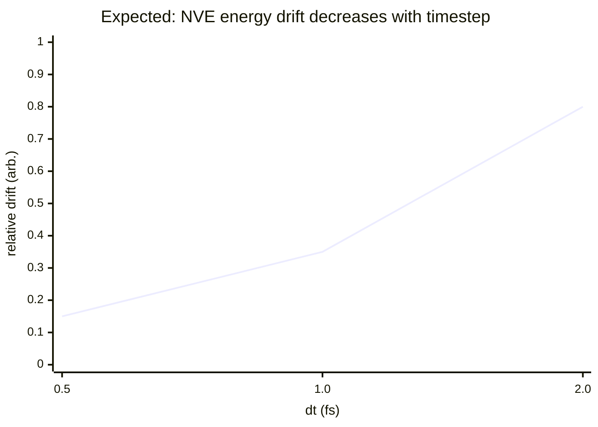
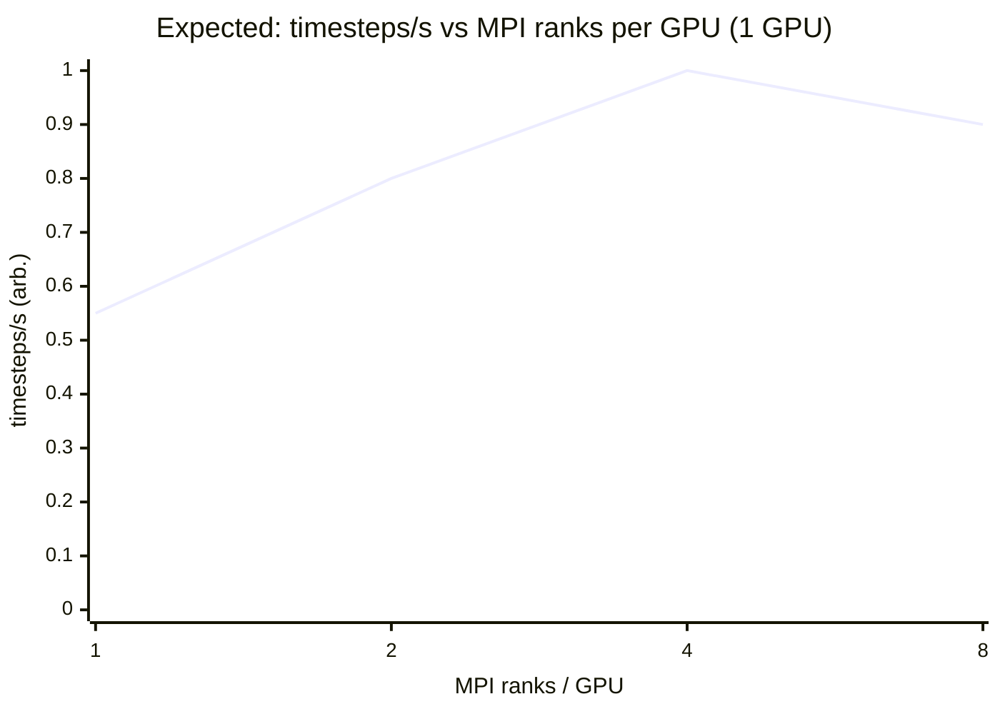

# Comprehensive Test Suite Design for a Time‑Decomposition MD Engine (tdmd) with Morse, EAM, and ML Potentials

## Executive summary

A time‑decomposition MD engine (“tdmd”) adds an additional axis of parallelism (time pipeline / zone wavefront) on top of the standard MD concerns (neighbor lists, force kernels, integration, thermostats/barostats, MPI/GPU communication, reproducibility). A comprehensive test suite therefore must do **two things at once**:

1) **Validate physics and numerics in isolation** (unit tests that localize errors to: neighbor construction, force evaluation, integration, zone scheduler, communication pack/unpack, ML descriptor/gradients).

2) **Continuously cross‑validate tdmd against LAMMPS** (integration/regression tests) using *comparable* semantics: `run 0` force checks (LAMMPS explicitly supports `N=0` runs), deterministic velocity generation (`velocity ... loop geom`), consistent neighbor rebuild rules (skin + “half-skin movement” trigger), and identical potential mappings (`pair_coeff * * ... mapping`). citeturn8view0turn0search1turn13view1turn5view2

For performance, the test suite must distinguish:

- **correctness‑oriented runs** (small systems, strict tolerances, high observability: per‑atom dumps, frequent thermos),
- **performance runs** (medium/large systems, minimal I/O, warmup windows, GPU/MPI sweeps), aligning with LAMMPS GPU guidance: try multiple MPI tasks per GPU (often 2–10), sweep precision modes, and record GPU “Time Info”/memory where available. citeturn5view4turn6view1

Key structural recommendation: treat LAMMPS as both **a comparator** and **a validator** via `rerun`: write snapshots (LAMMPS `dump custom`) from tdmd, then have LAMMPS read them and execute `run 0` per snapshot to compute forces/energies. This isolates whether mismatches come from tdmd’s integrator vs its force evaluation, and gives a stable “golden” oracle without storing full trajectories for every commit. citeturn7search3turn7search1turn8view0

The remainder of this report provides:

- a prioritized, category‑grouped test catalog with **purpose, exact steps, pass/fail criteria, and telemetry fields**;
- exact LAMMPS input snippets/commands and matching tdmd commands;
- performance benchmarking protocol (single‑GPU and multi‑GPU, MPI ranks per GPU, memory);
- precision and determinism tests (bitwise where feasible, mixed‑precision sweeps, summation order sensitivity);
- ML‑specific tests (descriptor reproducibility, gradient checks, GPU vs CPU parity);
- EAM/alloy and multi‑component alloy tests (mapping correctness, embedding sanity, cross‑interaction checks);
- failure modes and a diagnostic playbook; plus visualization/debug dump recommendations and a mermaid execution workflow.

## Scope, assumptions, and comparability contract

**Scope.** The suite targets tdmd features:

- Time‑decomposition “zones” / pipeline schedule (as described in your dissertation): zone readiness, safe handoff, buffer/skin invariants, cross‑zone dependency correctness.
- Potentials: Morse, EAM/alloy (setfl), and ML potentials (e.g., SNAP/ML‑IAP/OpenKIM).
- Platforms: CPU reference, NVIDIA GPU (single/multi GPU), MPI.

**Comparability contract with LAMMPS.** To compare tdmd vs LAMMPS in a way that is stable across MPI layouts and GPUs, enforce these invariants:

- **Force/energy oracle uses `run 0`.** LAMMPS allows `run N` with `N=0`, computing thermodynamics without advancing the system; `pre` and `post` options control setup/cleanup and can be used to streamline repeated short runs. citeturn8view0
- **Deterministic initial velocities independent of MPI.** Use `velocity ... loop geom`, which seeds per atom from atom coordinates and yields the same velocity for a given atom regardless of MPI process count (LAMMPS notes this explicitly). citeturn0search1
- **Neighbor rebuild discipline matches.** LAMMPS neighbor lists include a skin distance; neighbor rebuild triggers are based on atoms moving ~half the skin distance (configurable via `neigh_modify`). This same concept should define tdmd zone‑handoff safety (no zone boundary is “final” if any atom can cross it before the next rebuild/handoff). citeturn13view1turn10search4
- **EAM and ML mappings are explicit.** `eam/alloy` uses a single `pair_coeff * * file element...` mapping list that maps setfl elements to LAMMPS atom types. ML‑IAP and KIM wrappers also use explicit mapping lists. citeturn5view2turn11search11turn15view0
- **GPU mode semantics are acknowledged.** With the GPU package, neighbor builds on GPU (`neigh yes`) are default, but are not fully compatible with triclinic boxes (LAMMPS recommends `neigh no` if behavior differs). GPU package pair styles currently require `newton off` (more computation, less communication). citeturn6view1turn7search0

## Prioritized test catalog and specifications

### Test matrix overview

The table below is the **prioritized list** grouped by required categories. Each row corresponds to a test case that must be implemented in the harness.

**Notation.**  
- “LAMMPS‑cmp” indicates tdmd results are compared to LAMMPS.  
- “Unit” indicates a self‑contained unit test.  
- “System sizes” refer to small/medium/large benchmarks (see performance section).

| ID | Category | Priority | Test case | Mode |
|---|---:|---:|---|---|
| P1 | Physics correctness | Highest | `run 0` force/energy parity (Morse, EAM, ML) | LAMMPS‑cmp |
| P2 | Physics correctness | Highest | Short NVE trajectory parity + energy drift | LAMMPS‑cmp |
| P3 | Physics correctness | High | Neighbor list correctness & rebuild trigger invariants | Unit + LAMMPS‑cmp |
| P4 | Physics correctness | High | EAM/alloy multi‑element mapping correctness | Unit + LAMMPS‑cmp |
| P5 | Physics correctness | High | ML descriptor + force pipeline sanity (descriptor→model→forces) | LAMMPS‑cmp |
| N1 | Numerical/precision | Highest | Deterministic velocity generation parity (`loop geom`) | LAMMPS‑cmp |
| N2 | Numerical/precision | Highest | Summation/reduction order sensitivity (shuffle neighbors) | Unit |
| N3 | Numerical/precision | High | Mixed precision sensitivity sweep (CPU double vs GPU mixed/single) | Unit + LAMMPS‑cmp |
| N4 | Numerical/precision | Medium | Bitwise reproducibility (same GPU, fixed ranks) where possible | Unit |
| I1 | Integration/regression | Highest | LAMMPS `rerun` oracle on tdmd dumps | LAMMPS‑cmp |
| I2 | Integration/regression | High | NVT/NPT stability tests (T/P/Vol statistics) | LAMMPS‑cmp |
| I3 | Integration/regression | High | MSD diffusion coefficient extraction and parity | LAMMPS‑cmp |
| I4 | Integration/regression | Medium | Triclinic box CPU parity + GPU restriction checks | LAMMPS‑cmp |
| F1 | Performance | Highest | Single‑GPU baseline (timesteps/s, GPU time, memory) | tdmd‑only + LAMMPS baseline |
| F2 | Performance | Highest | MPI ranks per GPU sweep (2–10 typical) | tdmd‑only + LAMMPS baseline |
| F3 | Performance | High | Multi‑GPU strong scaling + comm breakdown | tdmd‑only |
| F4 | Performance | Medium | Memory scaling (host + device), peak allocations per step | tdmd‑only |
| ML1 | ML‑specific | Highest | Descriptor reproducibility CPU vs GPU | Unit |
| ML2 | ML‑specific | Highest | Gradient check (finite difference vs analytic forces) | Unit |
| ML3 | ML‑specific | High | Batch vs per‑atom evaluation equivalence | Unit |
| E1 | Alloy/EAM | Highest | setfl parsing + embedding density sanity | Unit |
| E2 | Alloy/EAM | High | Cross‑interaction sanity checks for multi‑element setfl | Unit |
| D1 | Diagnostics | High | Failure localization playbook validation (synthetic faults) | Unit |

Sources that motivate the “contract” tests: LAMMPS `run 0` semantics, deterministic velocity assignment, neighbor list skin and rebuild triggers, EAM mapping semantics, ML‑IAP mapping semantics, GPU package restrictions and MPI‑per‑GPU guidance. citeturn8view0turn0search1turn13view1turn5view2turn11search11turn6view1turn5view4

### Detailed test specifications by category

To keep this directly usable in CI, each test item below includes:

- **Purpose**
- **Required inputs**
- **Exact steps to run** (LAMMPS commands and tdmd commands)
- **Pass/fail criteria** (quantitative)
- **Telemetry fields** to record (log + JSON)

#### Physics correctness tests

| Test ID | Purpose | Required inputs | Exact steps to run | Pass/fail criteria | Telemetry fields |
|---|---|---|---|---|---|
| P1 | Establish a strict, local oracle for force/energy correctness at *t=0* (no integration drift). | One configuration file (LAMMPS `data` or dump snapshot), potential config. For EAM: a setfl file (e.g., 16‑element Zhou setfl from NIST or a quinary HEA setfl). citeturn19view0turn21view0turn5view2 | **LAMMPS:** run `run 0` with `dump custom` of `fx fy fz` and `compute pe/atom`. **tdmd:** evaluate forces/energies at step=0 and dump per‑atom values. citeturn8view0turn7search1turn7search6 | RMS force error ≤ tolerance table (see tolerances section). Total PE relative error ≤ tolerance. No NaNs. | `step`, `E_total`, `PE`, `virial`, `P`, `neighbor_builds`, `dangerous_builds`, `force_rms`, `force_maxabs`, `pe_rms`, `pe_maxabs`, `backend`, `precision_mode` |
| P2 | Validate integration + force consistency via short NVE and drift trend vs dt. | Same as P1 + dt list (e.g., 0.5/1.0/2.0 fs). | **LAMMPS:** `fix nve`, `run N` (N=50k) per dt; output `etotal` frequently. **tdmd:** identical dt sweep and logging. citeturn9view0turn8view0turn0search18 | Drift slope (per atom per time) below threshold; drift decreases as dt decreases; tdmd vs LAMMPS drift slopes within 2× statistical tolerance. | `dt`, `E_total(t)`, drift slope, `T`, `P`, `neighbor_rebuild_rate`, `time_breakdown` |
| P3 | Verify neighbor list correctness and rebuild triggers; catch missing interactions early. | Synthetic configs: random gas, dense crystal, “fast atom” stress case; plus chosen cutoff+skin. | **Unit:** compare tdmd neighbor list counts vs brute‑force O(N²) for small N; test rebuild trigger at half‑skin displacement. **LAMMPS‑cmp:** match neighbor rebuild settings `neighbor` + `neigh_modify` and compare counts. citeturn13view1turn10search4turn1search0 | Neighbor set equality for small N; for larger N compare counts within 0.1% and ensure no missed pair forces in force parity test. Trigger event when max displacement > 0.5*skin (as LAMMPS does). citeturn10search4 | `skin`, `cutoff`, neighbor_count, `max_displacement_since_build`, `rebuild_step_ids`, `dangerous_builds` |
| P4 | Ensure multi‑element mapping correctness: atom types → elements in setfl / ML mapping list. | Multi‑element config with all types present; EAM setfl file; mapping list. | **LAMMPS:** `pair_style eam/alloy`; `pair_coeff * * file e1 e2 ...` in correct atom‑type order. **tdmd:** same mapping file/CLI args. citeturn5view2turn19view0 | Permuting mapping must change energies/forces; correct mapping must match oracle within tolerance. Add explicit negative test (“wrong mapping”) that must fail. | `type_to_element_map_hash`, `setfl_element_order`, `mapping_validation_status` |
| P5 | Validate ML pipeline: descriptors → model → forces/virial are consistent and stable. | A small ML potential (SNAP / ML‑IAP / KIM model), plus config. | **LAMMPS:** `pair_style snap` or `pair_style mliap` or `pair_style kim` (depending on model). Dump per‑atom forces and global energies with `run 0`. **tdmd:** run matching model backend. citeturn11search0turn2search2turn15view0 | Force parity within tolerance; descriptor values reproducible across backends if applicable; no divergence in short NVE. | `descriptor_norm_stats`, `model_eval_time`, `force_rms`, `virial`, `ml_backend` |

#### Numerical and precision correctness tests

| Test ID | Purpose | Required inputs | Exact steps to run | Pass/fail criteria | Telemetry fields |
|---|---|---|---|---|---|
| N1 | Guarantee reproducible initial conditions independent of MPI layout (critical for time decomposition). | Same initial geometry. | **LAMMPS reference:** `velocity ... loop geom`; verify identical velocities for the same atom IDs across MPI counts. citeturn0search1 **tdmd:** implement an equivalent deterministic seeding option and compare velocity dumps. | Bitwise equal velocities (or within 0 for double) across MPI layouts in tdmd deterministic mode; match LAMMPS within ~1 ulp if using same RNG. | `seed`, `vel_init_mode`, `vel_hash`, `mpi_ranks`, `gpu_count` |
| N2 | Quantify sensitivity to summation order / reduction order and prevent “hidden nondeterminism.” | Same config; option to shuffle neighbor traversal and/or force accumulation order. | **tdmd unit:** run `run 0` multiple times with different controlled traversal orders; record force/energy variance. Use both CPU and GPU. | Variance stays below an upper bound; in deterministic mode variance is 0 (if implemented). Explain expectation: floating‑point is non‑associative and order matters (NVIDIA docs). citeturn12search0turn12search3 | `order_mode`, `force_rms_var`, `pe_var`, `bitwise_equal` |
| N3 | Mixed‑precision sensitivity sweep with pass/fail thresholds aligned to intended production mode. | Same config; multiple precision modes. | Run tdmd in `double`, `mixed`, `single` (if supported). Where possible, compare to LAMMPS CPU reference; note that accelerated styles may differ by round‑off/precision. citeturn13view0 | For each mode: force/energy errors within tolerance band; produce a regression envelope (baseline). | `precision_mode`, ulp stats, `force_rms`, `energy_rel`, `drift_slope` |
| N4 | Bitwise reproducibility where feasible (same GPU, same ranks, fixed scheduling). | Small geometry and deterministic settings. | Run tdmd twice under identical settings; compare binary dumps/hash. Document limits: atomics and parallel reductions can be nondeterministic due to scheduling; need deterministic reduction strategies for strict bitwise results. citeturn12search0turn12search3turn12search2 | Bitwise equal for the subset of kernels configured as deterministic; otherwise bound the divergence. | `run_hash`, `kernel_determinism_flags`, `atomic_usage_count` |

#### Integration and regression tests vs LAMMPS

| Test ID | Purpose | Required inputs | Exact steps to run | Pass/fail criteria | Telemetry fields |
|---|---|---|---|---|---|
| I1 | Create a robust regression oracle without storing huge “golden trajectories”: LAMMPS recomputes forces/energies on tdmd snapshots. | tdmd dump snapshots (`dump custom` format or equivalent); LAMMPS input for `rerun`. | **tdmd:** run short simulation; output snapshots (positions, optionally velocities). **LAMMPS:** `rerun` reads snapshots and does `run 0` per frame to compute energies/forces (LAMMPS doc describes this conceptual loop). citeturn7search3turn7search22turn8view0 | For each snapshot: force/energy mismatch within tolerance; trend diagnostics localize to integrator vs force kernel. | `snapshot_id`, `t_ps`, `force_rms`, `pe_rel`, `max_atom_force_diff`, `zone_state_summary` |
| I2 | Validate thermostats/barostats behavior and coupling terms (where supported). | Standard NVT/NPT input scripts; stable system (e.g., FCC alloy). | **LAMMPS:** `fix nvt`/`fix npt` from `fix_nh`; measure mean/σ of T/P/Vol after warmup. citeturn5view3 **tdmd:** if using same algorithms, match; if tdmd delegates to LAMMPS for thermo/barostat, compare state variables. | Mean target tracking and bounded fluctuations; tdmd vs LAMMPS means within tolerance (see tolerances). | `T_mean`, `T_std`, `P_mean`, `P_std`, `V_mean`, `dof`, `nh_chain_len` |
| I3 | Diffusion coefficient parity using MSD slope. | High‑T run config, MSD output. | **LAMMPS:** compute MSD (`compute msd`) and extract slope (LAMMPS howto explicitly states MSD slope ∝ diffusion). citeturn1search3turn1search7 **tdmd:** compute MSD identically; compare slopes over same window. | Diffusion coefficient agreement within loose statistical bound (typically 20–30% unless very long runs). | `msd(t)`, `fit_window`, `D`, `R²` fit quality |
| I4 | Ensure tdmd handles triclinic correctly on CPU and enforces GPU restrictions similar to LAMMPS guidance. | Triclinic box configs. | Use tdmd CPU as reference; on LAMMPS GPU package note neighbor list building on GPU is not fully compatible with triclinic (\*must be tested). citeturn6view1 | CPU triclinic parity vs LAMMPS CPU; GPU mode either matches or tdmd auto‑downgrades (`neigh no`) with explicit warning. | `box_type`, `gpu_neigh_mode`, `fallback_reason` |

#### Performance benchmarking tests

| Test ID | Purpose | Required inputs | Exact steps to run | Pass/fail criteria | Telemetry fields |
|---|---|---|---|---|---|
| F1 | Establish stable single‑GPU baseline performance on medium/large size. | Large benchmark configuration + minimal output. | Run tdmd with fixed settings and record throughput and breakdown. In LAMMPS, use GPU package guidance and record times; LAMMPS suggests sweeping MPI tasks per GPU and precision settings. citeturn5view4turn6view1 | Not a “pass/fail” by physics; instead maintain regression guardrails: no >10% drop from baseline for same build on same runner. | `timesteps/s`, `katom-steps/s`, kernel times, `comm_time`, `gpu_mem_peak`, `neighbor_time` |
| F2 | Find optimal MPI ranks per GPU (single GPU) and detect regressions in scaling curve. | Same as F1. | Sweep MPI ranks per GPU (e.g., 1,2,4,8). LAMMPS docs say 2–10 tasks per GPU often best. citeturn5view4 | Curve shape stable; peak within expected rank range; regression triggers if peak drops >10% or shifts drastically. | `mpi_ranks`, `gpu_util`, `pair_time`, `neigh_time`, `comm_time` |
| F3 | Multi‑GPU scaling (strong scaling) with comm breakdown; evaluate NCCL/MPI modes. | Large system; multi GPU launcher. | Run tdmd on 1,2,4,8 GPUs. Implement two comm backends: MPI GPU‑aware and NCCL collectives where appropriate. NCCL provides topology‑aware inter‑GPU primitives. citeturn3search3turn6view1 | Strong scaling efficiency targets (e.g., ≥70% at 2 GPUs, ≥50% at 4 GPUs, system‑dependent). Record comm fraction. | `gpus`, `strong_eff`, `p2p_bw`, `allreduce_time`, `zone_pipeline_depth` |
| F4 | Memory footprint scaling (host + device), detect leaks/fragmentation. | Medium and large cases. | Record peak and steady device allocations per step; LAMMPS GPU output includes “Max Mem / Proc” for GPU package runs. citeturn5view4 | Peak memory within planned budget; no monotonic growth across steps; leak detector in CI for CPU builds. | `gpu_mem_peak`, `gpu_mem_steady`, `alloc_count`, `realloc_count` |

#### ML‑potential specific tests

| Test ID | Purpose | Required inputs | Exact steps to run | Pass/fail criteria | Telemetry fields |
|---|---|---|---|---|---|
| ML1 | Descriptor reproducibility CPU vs GPU (prevents subtle divergence before model). | Small symmetric config; ML descriptor implementation. | Compute descriptors twice (CPU/GPU); compare arrays (L2/RMS). For SNAP and ACE, LAMMPS provides descriptor‑related computes (`compute sna/atom`, `compute pace`) which can be used as a reference for some models. citeturn11search19turn11search12 | Descriptor RMS ≤ 1e‑10 (double) or ≤ 1e‑6 (float) depending on mode; stable across MPI. | `descriptor_rms`, `descriptor_maxabs`, `descriptor_hash` |
| ML2 | Validate analytic gradients (forces) with finite differences of energy. | Same config; energy function accessible. | For random small displacements δ, compare \(-∂E/∂x\) vs FD derivative. Use multiple δ. (LAMMPS ML‑IAP exposes gradient concepts; compute_mliap exists for parameter gradients, reinforcing importance of gradients as first‑class quantities). citeturn2search2turn11search3 | Relative error decreases with δ until numerical noise; error band within tolerance. | `fd_delta`, `grad_rel_err`, `grad_abs_err` |
| ML3 | Batch vs per‑atom evaluation equivalence (important for GPU throughput). | ML model supporting both modes. | Run model in “batch atoms” and “per atom loop” modes on same config. | Force/energy parity within tolerance; speedup measured. | `eval_mode`, `model_time`, `force_rms` |
| ML4 | GPU vs CPU parity for ML kernel (ensures correct port). | Medium config. | Run ML on CPU and GPU under same precision goals; compare. | Within tolerance envelope. | `backend`, `precision`, `model_time`, `force_rms` |

#### Alloy/EAM tests

| Test ID | Purpose | Required inputs | Exact steps to run | Pass/fail criteria | Telemetry fields |
|---|---|---|---|---|---|
| E1 | setfl parsing and internal function sanity (Nrho/Nr/drho/dr, cutoffs). | A setfl file and mapping list. | Unit test parses header, array sizes, cutoff. For tdmd: verify tabulated functions are monotone where expected and no NaNs. For LAMMPS parity: `run 0` force check. LAMMPS docs describe setfl format and mapping. citeturn5view2 | Parse exactly; reject malformed files; forces finite. | `setfl_hash`, `Nrho`, `Nr`, `cutoff`, `parse_ok` |
| E2 | Embedding‑density consistency and ghost communication readiness (many‑body correctness). | Multi‑element dense config. | Unit: compute per‑atom density contributions two ways (direct sum and neighbor list) and compare; in multi‑GPU mode, validate communication pack/unpack invariants. LAMMPS developer docs note EAM needs intermediate per‑atom values communicated to ghost atoms for second pass. citeturn9view1turn9view0 | Density consistency within tolerance; no missing ghost contributions. | `rho_i_stats`, `rho_rms_err`, `comm_pack_bytes`, `ghost_count` |
| E3 | Cross‑interaction sanity for large‑element potentials (HEA setfl caution). | 16‑element setfl (NIST Zhou combined), plus test configs (random alloys). | Use NIST combined 16‑element potential; note NIST warns cross interactions were generated by universal mixing and many binaries/higher‑order may not be well optimized—so tests focus on numerical sanity, not physical realism. citeturn19view0 | No negative densities where forbidden, no NaNs, stable short NVE at conservative dt, bounded forces. | `nan_count`, `max_force`, `min_rho`, `unstable_step` |

## LAMMPS‑comparable runs and exact command/snippet table

### Canonical LAMMPS snippets used across tests

The snippets below are intentionally short and composable; the test harness can template them.

**Run‑0 force/energy dump (Morse example).** Uses the Morse formula and parameters as documented (including the explicit energy expression). citeturn13view0turn8view0turn7search1turn7search6

```lammps
units metal
atom_style atomic
read_data data.small

pair_style morse 6.0
pair_coeff 1 1 0.50 2.0 2.5 6.0

neighbor 2.0 bin
neigh_modify every 1 delay 0 check yes

compute cPE all pe/atom
dump d0 all custom 1 dump.run0 id type x y z fx fy fz c_cPE

run 0
```

**Run‑0 force/energy dump (EAM/alloy setfl mapping).** Mapping semantics (`pair_coeff * * file element...`) are defined in the EAM docs. citeturn5view2turn19view0

```lammps
units metal
atom_style atomic
read_data fcc16_4x4x4.data

pair_style eam/alloy
pair_coeff * * CuAgAuNiPdPtAlPbFeMoTaWMgCoTiZr_Zhou04.eam.alloy \
    Cu Ag Au Ni Pd Pt Al Pb Fe Mo Ta W Mg Co Ti Zr

compute cPE all pe/atom
dump d0 all custom 1 dump.run0 id type x y z fx fy fz c_cPE

run 0
```

**Deterministic initial velocities independent of MPI layout.** citeturn0search1

```lammps
velocity all create 300.0 123456 mom yes rot yes dist gaussian loop geom
```

**NVE drift test + thermo performance fields (spcpu).** LAMMPS defines `spcpu` as “timesteps per CPU second”. citeturn0search2turn5view3

```lammps
thermo 200
thermo_style custom step time temp pe ke etotal press vol density spcpu
fix f1 all nve
run 50000
unfix f1
```

**NVT/NPT via Nose–Hoover (fix_nh).** citeturn5view3

```lammps
fix fNVT all nvt temp 300.0 300.0 0.1
run 50000
unfix fNVT

fix fNPT all npt temp 300.0 300.0 0.1 iso 0.0 0.0 1.0
run 50000
unfix fNPT
```

**MSD diffusion extraction.** LAMMPS howto explicitly states diffusion coefficient is proportional to MSD slope. citeturn1search3turn1search7

```lammps
compute cMSD all msd com yes
fix fMSD all ave/time 100 10 1000 c_cMSD[4] file msd_total.dat
run 200000
```

**Rerun oracle (forces/energies on snapshots).** LAMMPS describes `rerun` as reading snapshots, setting timestep, and invoking `run 0` each iteration. citeturn7search3turn7search22

```lammps
rerun dump.from_tdmd first 0 last 1000 every 10 dump x y z box yes
```

### Command mapping table: LAMMPS vs tdmd

This table gives one row per comparable test, with an exact LAMMPS invocation pattern and a matching tdmd CLI pattern. These tdmd commands are proposed as a stable test interface; adapt names to your actual binaries.

| Test | LAMMPS command | LAMMPS snippet/file | tdmd command | tdmd snippet/args |
|---|---|---|---|---|
| `run0_morse` | `mpirun -np 1 lmp -in in.run0_morse` | `run 0` + `dump custom` | `tdmd run --case morse_run0 --steps 0` | `--pot morse --D0 ... --alpha ...` |
| `run0_eam16` | `mpirun -np 1 lmp -in in.run0_eam16` | `pair_style eam/alloy` mapping | `tdmd run --case eam_run0 --steps 0` | `--pot eam/alloy --setfl ... --map ...` |
| `nve_drift` | `mpirun -np 1 lmp -in in.nve_drift` | `fix nve; run 50000` | `tdmd run --case nve_drift --steps 50000` | `--ensemble nve --dt 0.001` |
| `nvt_stability` | `mpirun -np 1 lmp -in in.nvt` | `fix nvt ...` | `tdmd run --case nvt --steps 50000` | `--ensemble nvt --T 300 --Tdamp 0.1` |
| `npt_stability` | `mpirun -np 1 lmp -in in.npt` | `fix npt ... iso ...` | `tdmd run --case npt --steps 50000` | `--ensemble npt --T 300 --P 0 --Pdamp 1.0` |
| `msd_diffusion` | `mpirun -np 1 lmp -in in.msd` | `compute msd` + `fix ave/time` | `tdmd run --case msd --steps 200000` | `--msd --msd-window ...` |
| `rerun_oracle` | `mpirun -np 1 lmp -in in.rerun` | `rerun dump.from_tdmd ...` | `tdmd dump --every 10` | `--dump-format lammps_custom` |
| `gpu_single` | `mpirun -np 4 lmp -sf gpu -pk gpu 1 neigh yes -in in.perf` | GPU package | `mpirun -np 4 tdmd ... --gpu 1` | `--gpu-neigh on --newton off` |
| `gpu_multi` | `mpirun -np 32 lmp -sf gpu -pk gpu 4 neigh yes -in in.perf` | GPU package | `mpirun -np 32 tdmd ... --gpus 4` | `--comm mpi-gpu-aware|nccl` |

Relevant LAMMPS semantics and defaults: GPU package options are controlled via `package gpu`/`-pk`, `neigh yes` means neighbor builds on GPU, and `newton off` is currently required for GPU pair styles; neighbor builds on GPU are not fully compatible with triclinic boxes. citeturn6view1turn5view4turn7search0

## Precision, tolerance recommendations, and rationale

### Why tolerances must be tiered

You cannot use a single “tight” tolerance across all backends because:

- Floating‑point arithmetic is non‑associative; changing summation order changes results (NVIDIA explicitly warns that parallelizing changes operation order and results may not match sequential). citeturn12search0
- GPU execution order, especially with atomics, can be nondeterministic; atomic updates may occur in different orders run‑to‑run. citeturn12search3
- LAMMPS itself states accelerated pair styles should produce the same results “except for round‑off and precision issues.” citeturn13view0
- LAMMPS also notes `newton on/off` should yield the same answers except for round‑off (but communication/computation patterns differ). citeturn7search0

Therefore, the suite should define **tolerance tiers** by (a) backend class and (b) test sensitivity.

### Recommended tolerance table

All tolerances refer to comparing tdmd against a LAMMPS reference *or* tdmd CPU double reference, using per‑atom and global metrics.

**Definitions.**  
- Force RMS error: \( \sqrt{\frac{1}{3N}\sum_i \|\Delta \mathbf{f}_i\|^2} \) in eV/Å.  
- Energy relative error: \( |\Delta E| / \max(|E|, E_\text{floor}) \) with \(E_\text{floor}=1\text{ eV}\).  
- Per‑atom PE RMS uses `compute pe/atom` on LAMMPS side. citeturn7search6turn4search2

| Comparison type | Backend pair | Force RMS | Force max abs | Total PE abs | Total PE rel | Rationale |
|---|---|---:|---:|---:|---:|---|
| `run 0` strict | tdmd CPU double vs LAMMPS CPU double | 1e‑7 | 1e‑5 | 1e‑6 eV | 1e‑9 | Same math order likely; should be tight. |
| `run 0` GPU mixed | tdmd GPU mixed vs LAMMPS CPU | 1e‑5 | 1e‑3 | 1e‑4 eV | 1e‑6 | Round‑off, different reductions, GPU mixed precision. citeturn5view4turn12search0 |
| `run 0` ML | tdmd vs LAMMPS ML backend | 1e‑4 | 1e‑2 | 1e‑3 eV | 1e‑5 | ML kernels often use atomics/reductions; looser. citeturn12search3 |
| NVE drift | tdmd vs LAMMPS | drift slope within 2× | — | — | — | Drift is sensitive; compare trends and slopes. |
| NVT mean T | tdmd vs LAMMPS | — | — | — | | Mean within 0.5% (CPU) / 1% (GPU); std within 20%. citeturn5view3 |
| NPT mean P/V | tdmd vs LAMMPS | — | — | — | | Mean P within 200 bar; V within 1% after equilibration. |
| MSD diffusion | tdmd vs LAMMPS | — | — | — | | \(D\) within 20–30% unless very long. citeturn1search3 |

These are engineering tolerances designed to avoid false positives in CI while still catching meaningful regressions. Tighten them once tdmd stabilizes and deterministic reduction options are implemented (NVIDIA discusses deterministic reduction strategies such as reproducible accumulators in CCCL/CUB contexts). citeturn12search2turn12search10

## Performance benchmarking protocol and metrics

### Benchmark sizes, timesteps, and neighbor settings

**System sizes (small/medium/large).**

- Small: 256–2k atoms — correctness, quick CI (`run 0`, short NVE).  
- Medium: 16k–64k atoms — single‑GPU tuning, measurable throughput.  
- Large: 128k–1M atoms — multi‑GPU scaling and comm stress.

**Timestep options (metal units examples).** Use dt sweeps (0.5, 1.0, 2.0 fs) for drift studies; for performance lock dt to the “production” value that yields stable neighbor rebuild rate (avoid excessive rebuilds). LAMMPS “dangerous builds” (half‑skin displacement) is an early signal that dt may be too large. citeturn13view1turn10search4turn10search17

**Neighbor settings.** Start conservative for correctness; then explore performance:

- Correctness: `neighbor 2.0 bin` + `neigh_modify every 1 delay 0 check yes`. citeturn13view1turn10search17  
- Performance sweep: keep skin fixed; vary `every` (e.g., 1, 5, 10) and monitor “dangerous build” risk, consistent with LAMMPS rebuild triggers. citeturn10search4

### Single‑GPU launch commands and measurement windows

**LAMMPS GPU package baseline.** LAMMPS recommends experimenting with multiple MPI tasks per GPU (often 2–10) and precision settings for best performance; its GPU timing also reports memory and GPU routine breakdown at end of run. citeturn5view4

Example single‑GPU runs:

```bash
# 1 GPU, 4 MPI ranks (typical starting point)
mpirun -np 4 lmp -sf gpu -pk gpu 1 neigh yes -in in.perf

# Sweep ranks per GPU
for np in 1 2 4 8; do
  mpirun -np $np lmp -sf gpu -pk gpu 1 neigh yes -in in.perf
done
```

Here, `neigh yes` means neighbor lists are built on GPU by default; but note LAMMPS warns GPU neighbor list building is not fully compatible with triclinic boxes, so these performance baselines should be orthogonal boxes unless explicitly testing triclinic behavior. citeturn6view1

**Measurement protocol.**

- Warmup: 5k–20k steps (GPU kernel caching, neighbor list steady state).
- Measure window: 50k–200k steps with **no heavy dumps** (dumping dominates runtime).
- Record: `timesteps/s`, `katom-steps/s`, and breakdown times; in LAMMPS include `spcpu` for on‑the‑fly rate. citeturn0search2turn5view4

### Multi‑GPU protocol and comm backends

**tdmd:** implement at least two comm modes:

- `mpi-gpu-aware` (device buffers, if available; LAMMPS exposes a `gpu/aware` toggle for accelerator packages). citeturn6view1
- `nccl` for collectives and/or point‑to‑point where convenient; NCCL is topology‑aware and provides inter‑GPU primitives. citeturn3search3

Example multi‑GPU launch patterns (generic):

```bash
# 4 GPUs, 32 ranks total (8 ranks/GPU) - strong scaling sweep
mpirun -np 32 tdmd run --case perf_large --gpus 4 --comm mpi-gpu-aware

# Same but NCCL collectives enabled
mpirun -np 32 tdmd run --case perf_large --gpus 4 --comm nccl
```

**Metrics to record per run** (tdmd + LAMMPS baseline):

- Throughput: `timesteps/s`, `katom-steps/s`.
- Breakdown: `pair_time`, `neigh_time`, `integrate_time`, `comm_time`, `output_time`.
- GPU specifics: kernel times (Nsight Compute), overlap ratio, memcpy time, device occupancy indicators.
- Communication specifics: bytes/step, halo exchange time, collective time (if any).
- Memory: `gpu_mem_peak`, `gpu_mem_steady` (LAMMPS GPU output includes max GPU memory per MPI process). citeturn5view4turn12search1

## Test harness design, CI jobs, and telemetry storage

### Test layers and automation

Adopt a three‑tier structure aligned with how LAMMPS itself conceptualizes testing: fast unit tests for local behavior, command‑line/integration tests for executable behavior, and larger system tests. LAMMPS developer docs emphasize that unit tests should run fast and cover local behavior. citeturn0search3turn0search7

**Recommended layers.**

1) **Unit tests (fast, deterministic):**  
   - Neighbor list brute‑force checks, mapping validation, Morse analytic/FD, EAM parsing, ML descriptors and gradient checks, zone scheduler invariants.

2) **Integration tests (LAMMPS comparator):**  
   - `run 0` parity across potentials, short NVE parity, NVT/NPT, MSD diffusion.

3) **System/performance tests (nightly/weekly):**  
   - Medium/large cases, single‑GPU sweeps, multi‑GPU scaling, memory stress.

### Seed handling and deterministic velocity generation

- Always store and log seeds and determinism modes.
- Use the LAMMPS pattern `velocity ... loop geom` in comparator runs to get velocities independent of MPI process count (explicitly documented), then implement an equivalent tdmd mode. citeturn0search1

### Golden references and artifact management

**Principle:** golden references should be **small, hashed, and reproducible**.

- For force/energy parity: store **one snapshot** (`dump.custom`) per test case (small/medium), plus computed per‑atom forces/PE.
- For trajectory‑based regression: store **sparse snapshots** (e.g., every 10 steps for 1k steps), and validate via LAMMPS `rerun` to avoid large golden data. LAMMPS explicitly supports this workflow: rerun reads snapshots and does `run 0` to compute energy/forces each iteration. citeturn7search3turn7search22

**Artifact storage recommendations.**

- Store per test run:
  - `tdmd.jsonl` (telemetry),
  - `dump.*` snapshots (compressed),
  - `compare_report.json` (computed metrics),
  - optional Nsight profiles for performance runs.
- Keep a manifest `golden_manifest.yml` including:
  - hash of input files (data, setfl, ML model file),
  - LAMMPS version/commit,
  - GPU driver/CUDA versions (for performance baselines).

### JSONL telemetry schema example

A minimal JSONL schema (one record per thermo interval plus an end‑of‑run summary):

```json
{"kind":"step","case":"eam16_run0","step":0,"t_ps":0.0,"backend":"gpu","precision":"mixed",
 "E_total":-12345.67,"PE":-13000.12,"KE":654.45,"T":300.2,"P_bar":-12.3,
 "neighbor_build":true,"skin":2.0,"cutoff":6.0,"dangerous":0,
 "pair_time_ms":0.31,"neigh_time_ms":0.12,"comm_time_ms":0.08,"output_time_ms":0.01,
 "gpu_mem_peak_mb":812,"zone_pipeline_depth":4}
{"kind":"summary","case":"eam16_run0","timesteps_per_s":15234.0,"katom_steps_per_s":199.3,
 "force_rms":1.2e-5,"E_rel":3.1e-7,"status":"pass"}
```

For comparability, mirror LAMMPS categories “Pair / Neigh / Comm / Output / Modify” in tdmd breakdown. LAMMPS documents that it prints timing statistics and provides detailed developer explanations of the timestep stages (neighbor decide, forward_comm, exchange, build, force compute, reverse_comm), which should map to tdmd stages. citeturn9view0turn5view4turn8view0

### Prometheus / OpenTelemetry hooks

- **Prometheus**: export gauges for throughput and memory; counters for NaN events, neighbor rebuild count, comm bytes.
- **OpenTelemetry**: represent each step interval as a span; attach NVTX ranges for Nsight correlation (Nsight Systems explicitly recommends NVTX markers/ranges to correlate CPU ranges and resulting GPU activity). citeturn3search2turn3search10

## Failure modes, diagnostics, and visualization/debug dumps

### Failure localization playbook

The goal is to quickly decide whether an error is in:

- neighbor lists / halo construction,
- potential evaluation (Morse/EAM/ML),
- integration / thermostatting,
- communication / synchronization,
- time‑decomposition scheduler (zone handoff).

**Diagnostic ladder (practical order).**

1) **Start with `run 0` parity.** If forces differ at step 0, it is not an integrator bug; it is neighbor/potential/mapping. Use per‑atom diff maps. citeturn8view0turn7search1

2) **Check mapping and species identity.** For EAM/alloy, mapping list order defines how atom types map to setfl elements; incorrect mapping will not “sort itself out.” citeturn5view2turn19view0

3) **Neighbor rebuild logic and “half skin” threshold.** If tdmd hands off zones too early (or rebuilds too infrequently), you will miss interactions; LAMMPS neighbor docs tie rebuild triggers to skin and explicitly state migration happens on the timestep neighbor lists are rebuilt. citeturn13view1turn10search4

4) **EAM intermediate quantities and ghost comm.** EAM is many‑body; LAMMPS developer communication docs point out that many‑body pair styles (EAM) compute intermediate per‑atom values that must be communicated to ghost atoms for the second pass, requiring explicit pack/unpack callbacks. If tdmd’s time pipeline changes when/where ghost values are valid, this is a frequent source of subtle errors. citeturn9view1turn9view0

5) **Integrator staging and PBC remap semantics.** LAMMPS developer flow notes that PBC remapping is not done every timestep but when neighbor lists are rebuilt; dumps can contain slightly out‑of‑box coordinates if not dumped on rebuild steps. If tdmd applies PBC differently, direct coordinate comparisons can be misleading—force comparisons are a safer oracle. citeturn9view0

6) **Newton on/off and communication tradeoffs.** LAMMPS states `newton off` computes interactions on both processors for cross‑processor pairs and avoids communicating resulting force contributions; results should match except for round‑off. GPU package currently requires `newton off`. tdmd must match its own newton policy when comparing. citeturn7search0turn6view1

7) **GPU nondeterminism and floating point order.** If CPU matches but GPU differs run‑to‑run, suspect atomics/reduction order. NVIDIA documents that floating point is not associative and order matters; atomic execution order can vary due to nondeterministic thread scheduling. citeturn12search0turn12search3

### Visualization and debug dump recommendations

LAMMPS provides several useful patterns you can emulate or reuse:

- **Trajectory visualization**: dumps in native LAMMPS format can be viewed with OVITO/VMD; LAMMPS documents this and positions it as the common workflow. citeturn14search1
- **On‑the‑fly rendered images**: `dump image` can render PNG/JPEG frames or movies. This is ideal for CI artifacts when a test fails. citeturn14search0
- **VTK/ParaView**: `dump vtk` outputs VTK‑readable data for ParaView workflows. citeturn14search2

tdmd‑specific debug outputs (high ROI for time decomposition):

1) **Per‑zone state dump** (each step interval): zone id, time slice id, state (empty/received/ready/computing/sent), hazard flags (boundary crossing risk), neighbor rebuild epoch id.

2) **Zone heatmap**: 2D image where x=zone id, y=time slice (pipeline stage), color=state or time spent. Useful to see pipeline bubbles.

3) **Force difference maps**: per‑atom vector magnitude `|f_tdmd - f_ref|` on a snapshot; output as dump custom field and visualize in OVITO.

4) **Neighborhood discrepancy dump**: store neighbor counts per atom with hash of neighbor IDs (small systems): helps isolate incorrect neighbor trimming.

image_group{"layout":"carousel","aspect_ratio":"16:9","query":["LAMMPS dump image example rendered atoms","OVITO visualization LAMMPS dump trajectory","NVIDIA Nsight Systems NVTX timeline example","ParaView VTK particle visualization"],"num_per_query":1}

### Mermaid workflow for automated test execution

```mermaid
flowchart TD
A[Select test case & backend matrix] --> B[Generate/checkout inputs: data, setfl, ML model]
B --> C[Run LAMMPS reference (CPU or GPU baseline)]
C --> D[Run tdmd (matching settings)]
D --> E[Collect artifacts: logs, JSONL, dumps]
E --> F[Compute metrics: force/energy RMS, drift, MSD slope, perf]
F --> G{Pass?}
G -- yes --> H[Record baseline + upload summary]
G -- no --> I[Auto-diagnose: mapping? neighbor? EAM ghost? GPU nondet?]
I --> J[Emit debug dumps: zone states, force diff, neighbor diff]
J --> K[Attach visualization frames + rerun oracle report]
```

### Expected trend charts (illustrative)





LAMMPS GPU documentation explicitly recommends experimenting with MPI ranks per GPU and precision settings; the curve often peaks at a few ranks per GPU before overhead dominates. citeturn5view4

## LAMMPS best practices and code patterns to adopt in tdmd

This section lists specific LAMMPS patterns that have direct impact on correctness + CI comparability.

- **Neighbor skin strategy and rebuild triggers**: LAMMPS neighbor lists include all pairs within cutoff+skin; larger skin reduces rebuilds but increases pair checks; rebuild trigger is typically “half skin moved” (configurable). This should be mirrored in tdmd zone handoff safety criteria. citeturn13view1turn10search4
- **`run 0` semantics and `pre/post` control**: `run 0` computes thermodynamics without timestepping; `pre` and `post` allow skipping setup/cleanup for repeated short calls (useful when tdmd calls LAMMPS as a library or for oracle loops). citeturn8view0
- **Deterministic velocity assignment across MPI via `loop geom`**: required for reproducible comparisons when varying MPI ranks and time-decomposition schedules. citeturn0search1
- **Thermo performance fields (`spcpu`, `tpcpu`)**: LAMMPS defines these as on-the-fly speed metrics; adopt analogous tdmd fields for comparable plots/alerts. citeturn0search2
- **EAM/alloy mapping**: one `pair_coeff` maps setfl elements to atom types; tests must validate mapping order and allow “NULL” placeholders in hybrid contexts if you support them. citeturn5view2
- **Many‑body comm patterns**: EAM requires intermediate per‑atom values to be communicated to ghost atoms for a second pass; LAMMPS provides a callback‑based pack/unpack scheme in the Comm class—tdmd should implement an analogous explicit contract for zone+halo validity. citeturn9view1
- **`newton on/off` tradeoffs**: `newton off` duplicates computation for cross‑processor pairs but reduces communication; results should match except round‑off. GPU package currently requires `newton off`. tdmd should treat this as a key configuration dimension for correctness/performance. citeturn7search0turn6view1
- **Triclinic handling on GPU**: LAMMPS warns GPU neighbor builds are not fully compatible with triclinic boxes; for triclinic tests either force CPU neighbor builds or validate behavior explicitly. citeturn6view1
- **Unit test structure**: LAMMPS developer guidance emphasizes fast, local-behavior unit tests and a dedicated test infrastructure; mirror this separation of concerns. citeturn0search3turn0search7
- **NVTX instrumentation for profiling**: Nsight Systems recommends adding NVTX ranges to correlate CPU phase regions with GPU work; adopt NVTX as a first‑class instrumentation API around the tdmd pipeline stages (zone compute, pack/unpack, neighbor build, ML eval). citeturn3search2turn3search10

## NIST and OpenKIM input sources for portable, licensed test assets

For a CI‑friendly suite, choose potentials and models that are stable, citable, and redistributable under clear terms.

- The entity["organization","National Institute of Standards and Technology","us standards agency"] Interatomic Potentials Repository provides EAM/alloy setfl files and explicitly notes the purpose: a source for interatomic potentials and related files with references, encouraging download/use with acknowledgement. citeturn18search9turn17view0
- The NIST combined 16‑element Zhou setfl file (useful for multi‑component alloy stress testing) is explicitly listed, with a caution that cross interactions use a universal mixing function and many binaries/higher-order systems may not be well optimized—therefore treat this as a *numerical stress test*, not a guarantee of physical realism. citeturn19view0
- The NIST quinary HEA FeNiCrCoCu setfl with ZBL correction is listed and described as suitable for radiation studies; it is a strong mid‑complexity multi‑element case for diffusion and thermostat tests. citeturn21view0
- entity["organization","Open Knowledgebase of Interatomic Models","openkim repository"] supports standardized model distribution and LAMMPS integration via `pair_style kim`/`kim` command; licensing policy documents acceptable open‑source licenses, which helps with legal distribution of test assets. citeturn15view0turn3search1

These sources let you define a portable test asset bundle: `{data files} + {setfl files} + {KIM IDs / ML models} + {hash manifest}`.

